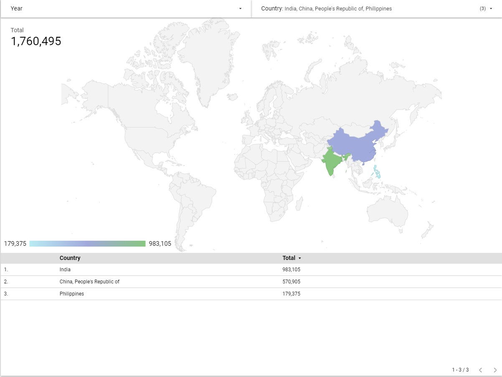
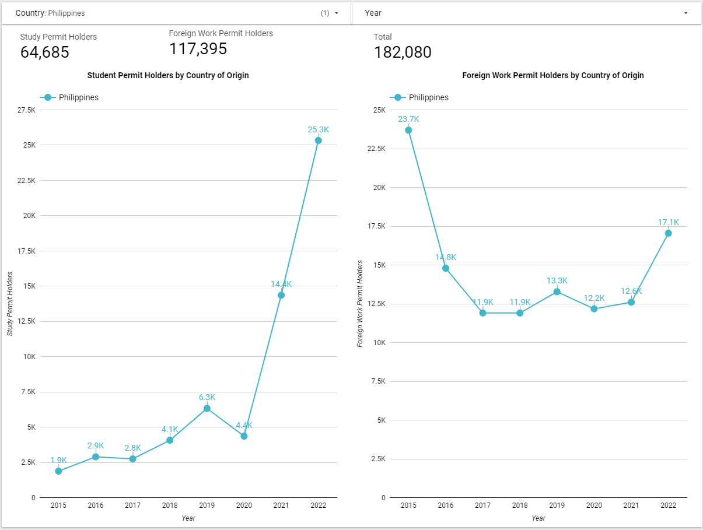
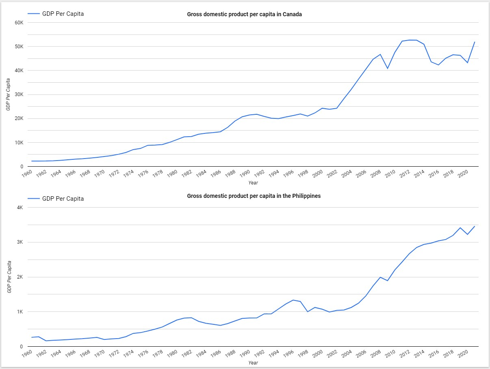
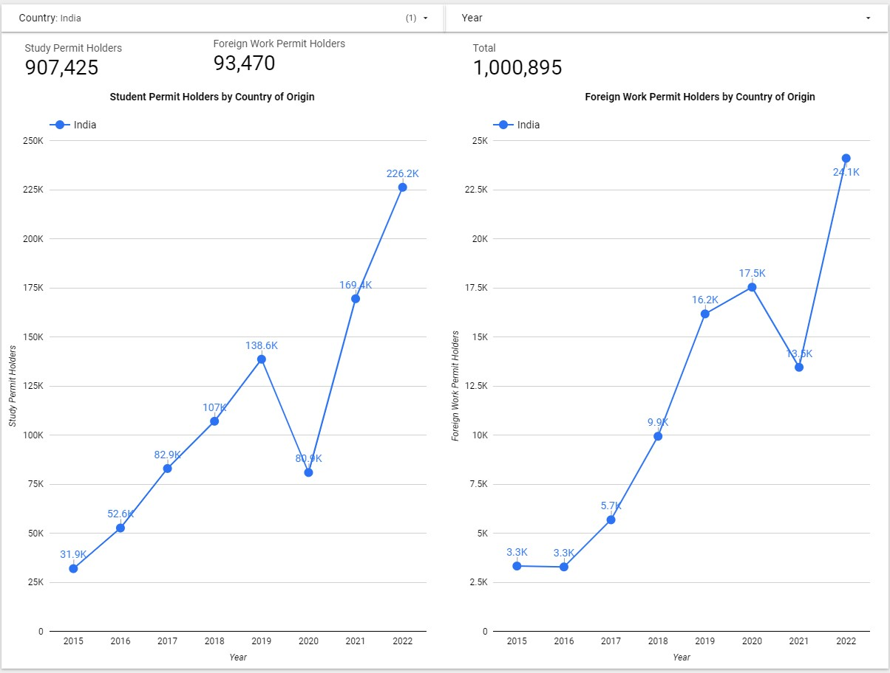
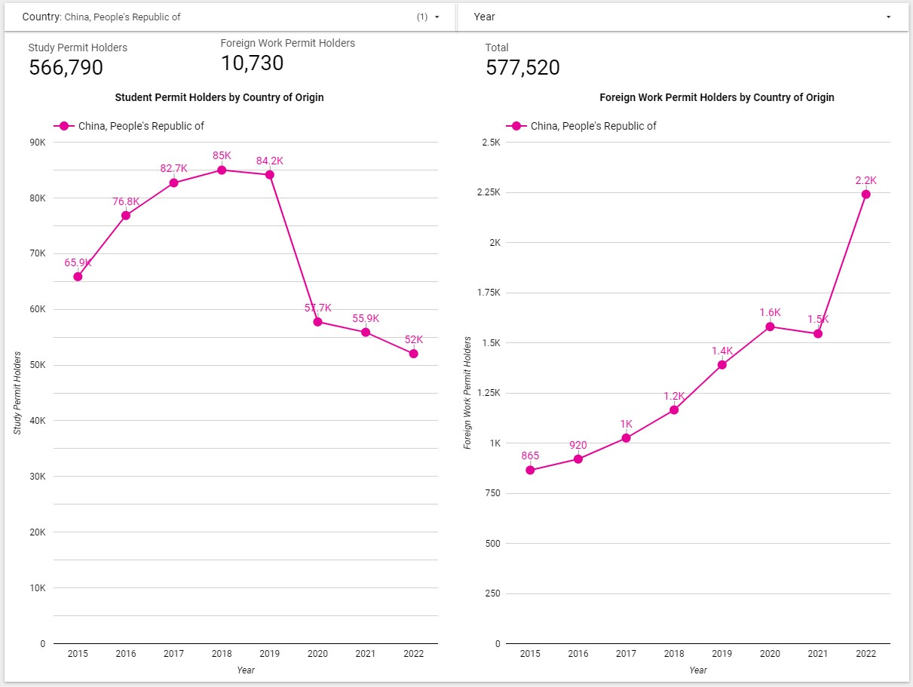

## <a href="https://lajatto.github.io/">Back to homepage</a>

# immigration_canada

## India, China, and the Philippines are the top three sources of Study Permit and Foreign Work Permit holders in Canada from 2015 to 2022. I’m going to take a look at these 3 countries and their immigration trends. These three countries alone have a combined total of 1,760,496 citizens with either a study or foreign work permit in Canada. That is 51.32% of the total number of foreign students and workers in Canada. That’s why I got curious and wanted to find out the stories behind the data. 

The data I used here are from the Canadian Government <a href="https://open.canada.ca/data/en/dataset/360024f2-17e9-4558-bfc1-3616485d65b9"> website </a>  so I am pretty sure that these are reliable. 

If you want to play around with the Looker dashboard that I made for this you can access it <a href="https://lookerstudio.google.com/reporting/6b64420c-d537-412d-9ea1-947e980344a4"> here. </a>

### First off, my home country, the Philippines. 

In 2015 the Philippines saw a record high of 23,700 Filipinos given Foreign Work Permits in Canada. This can be attributed to the <a href="https://www.dole.gov.ph/news/canada-offers-jobs-and-permanent-residency-through-its-express-entry-and-nova-scotias-regional-labor-market-demand-stream/"> aggressive campaign of the Canadian government </a> to fill job vacancies. In 2014 Canada gave birth to the “Express Entry” program. The "Express Entry" program is a fast and flexible model for economic migration, inviting candidates with a valid job offer or nomination to apply for permanent residency. Nova Scotia also introduced the New Nominee Program - Regional Labor Market Demand Stream selects individuals who meet the labor market needs, intend to pursue employment in an "in demand" occupation, and wish to live in Nova Scotia. 

These opportunities and the continuously declining economy of the Philippines during that time encouraged the 23,700 Filipinos to try their luck in Canada and provide a better life for their family. 

During 2016, there was a decline in Filipinos obtaining foreign work permits in Canada. This could be attributed in part to the strong economy of the Philippines during that period. While Canada's GDP growth rate was at a low of 0.3% in 2015 and peaked at 3.04% in 2017 before slowing down in the following two years, the Philippines was experiencing a boom, as per data from Macrotrends. The platform indicates that from 2015 to 2019, the Filipino GDP growth rate ranged between 6.12% and 7.15% annually, which is more than double the growth rate of the Canadian economy. Therefore, there was a greater availability of job opportunities in the Philippines during those years, which could have contributed to the decrease in Filipinos seeking work abroad in Canada.

It is also worth noting that Canada’s Express Entry draws were paused in late December 2020. So with one of the most common ways for immigrants to start working in Canada on hold.

After 2020 a new trend of becoming a permanent resident in Canada started, the Student Visa route. The number of study permits approved saw an almost 250% increase from 2020 to 2021. In 2020, 4,400 study permits were approved while in 2021, 14,400 study permits were approved. Up until now this is still one of the most common entry-ways of Filipinos to Canada. 

If it weren’t for the pandemic we would probably see a continuous upward trend with study permit and foreign work permit holders from the Philippines. 

This upwards trend in the number of Filipino study permit holders in Canada is expected to continue throughout 2023.

### India

Next up we have India. The second most populated country in the world, next to China. No wonder we see India at the top of this list. Total Indian Permanent Residents in Canada as of 2022 is 570,515. The more shocking note? This is just 0.04% of India’s total population! 

Nearly one-third of the 405,000 immigrants welcomed to Canada in 2021 were of Indian origin.
Almost 50% of the 450,000 international students welcomed to Canada in 2022 were from India. 
Indians possess attributes required by Immigration, Refugees and Citizenship Canada (IRCC) such as education, language skills, work experience, and settlement funds. The lack of permanent residence pathways in the U.S. has led to an increasing number of Indian foreign workers moving to Canada to pursue permanent residence. 

Same story with the Philippines, steady influx of immigrants to Canada until the Express Entry pause and Covid happened. 

### China

China now tells a different story than the Philippines and India. While those two countries see a rise in their citizens studying in Canada, China has the exact opposite. Since the start of the pandemic the number of Chinese people getting study permits in Canada has been on a decline. The decline is partly because of the pandemic, and partly because of eroding diplomatic relations between China and Canada in recent years. Other key reasons to this are the following: 
<ul>
  <li>Increased capacity and quality in China’s higher education system.</li>
  <li>Chinese employers’ greater interest in hiring Chinese-educated graduates.</li>
  <li>Continuing fears about contracting COVID-19 abroad and being unable to return home.</li>
  <li>Awareness of xenophobia directed towards Chinese students in the US at the outset of the pandemic, when some unfairly associated Chinese students with the emergence of the virus.</li>
  <li>Shifts in global power and influence between China and the West.</li>
 </ul>
 
 Although Chinese students in Canada have declined, the number of Chinese foreign workers in Canada is on an opposite trend. This is due to a wave of "run" that has swept across China as citizens become increasingly dissatisfied with President Xi Jinping's three consecutive terms and strict epidemic control measures. As a result, there has been a surge in applications for immigration to Canada, which has long been a favored destination for Chinese immigrants.

The trend of Chinese people leaving China to live in other countries is a complex phenomenon driven by economic, political, and social factors. Wealthy Chinese people may be motivated to leave the country due to limited opportunities for social mobility, economic uncertainty, and political instability. Additionally, the desire for better economic opportunities, a more open and democratic society, and the opportunity to live and study abroad are global trends driving Chinese people to seek new homes in a variety of countries around the world.

While Canada is a popular destination for Chinese immigrants, it is important to note that this trend is not limited to Canada alone. Chinese people are also leaving the country to live in other destinations, such as the United States and Australia. As China continues to evolve and change, it is likely that this trend will continue to evolve and change as well, reflecting the changing needs and desires of the Chinese people.

